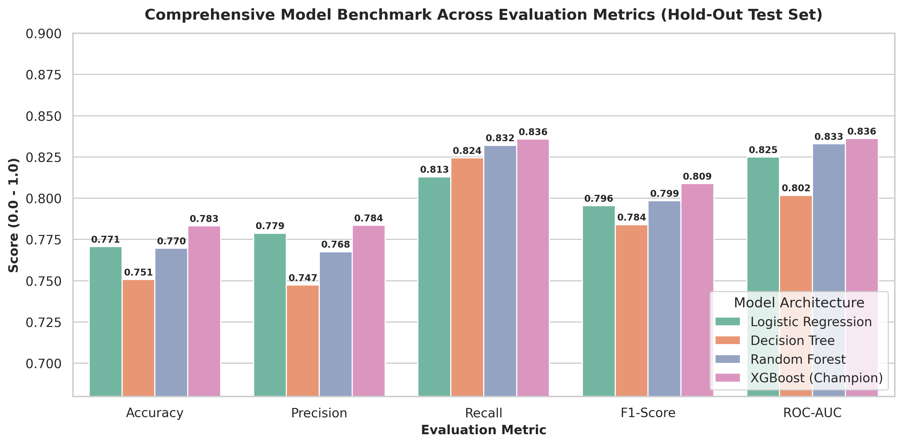
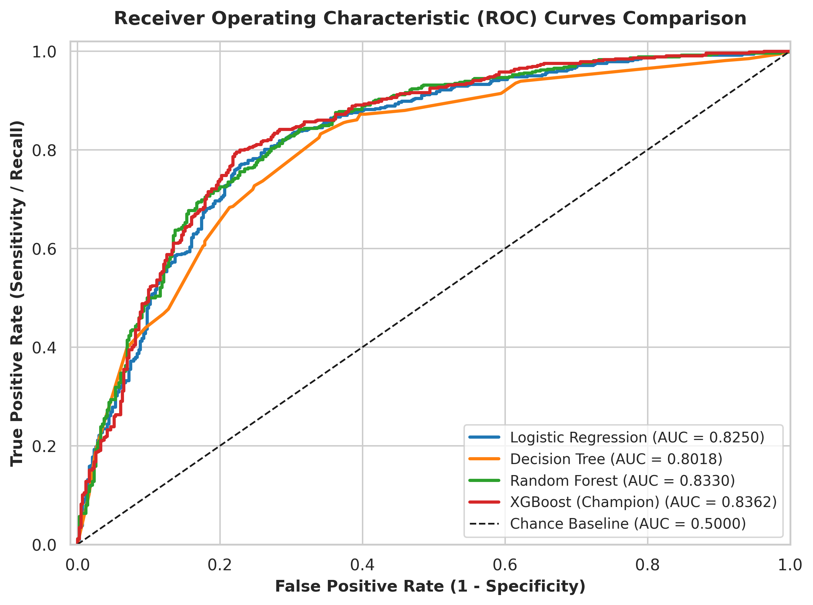
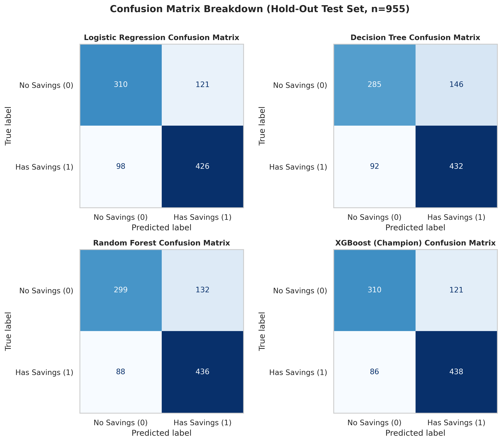
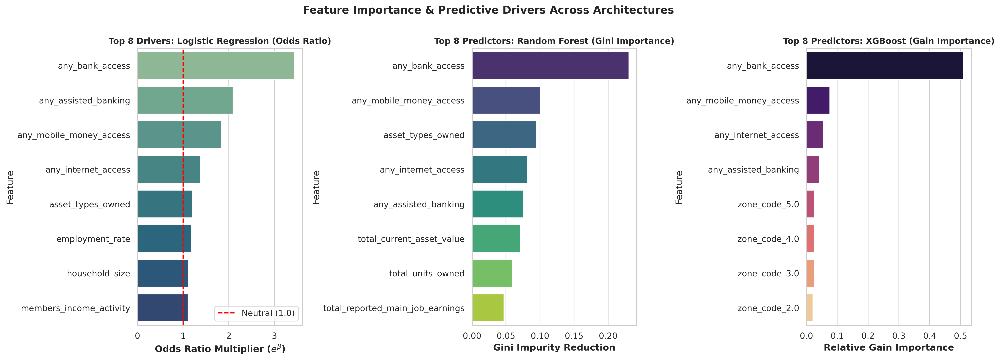

# Predicting Household Savings Behavior in Nigeria

[](https://www.python.org/)
[](https://streamlit.io/)
[](https://scikit-learn.org/)
[](https://xgboost.readthedocs.io/)
[](LICENSE)

**CSC 572 – Machine Learning Course Project**  
**Dataset:** Nigeria General Household Survey (GHS), Panel Wave 5 (2023/2024) (4,771 Households)  
**Target:** Binary Classification (`savings_target`: 1 = Has Savings, 0 = No Savings)  

---

## 📌 Project Overview

Promoting household savings is a foundational pillar for poverty alleviation, economic resilience, and financial inclusion across Sub-Saharan Africa. In Nigeria, despite ongoing regulatory initiatives by the **Central Bank of Nigeria (CBN)** under the **National Financial Inclusion Strategy (NFIS)**, significant gaps in formal and informal savings adoption persist across socio-demographic classes and geopolitical regions.

This project develops an end-to-end, leak-free supervised machine learning pipeline to model and predict household savings behavior using microdata from the **Nigeria General Household Survey, Panel Wave 5 (2023/2024)** conducted by the National Bureau of Statistics (NBS) and the World Bank. 

We benchmark four machine learning models—**Logistic Regression**, **Decision Tree**, **Random Forest**, and **XGBoost**—and package the resulting models into an interactive **Streamlit web application** featuring a real-time household savings predictor and a policy simulation dashboard.

---

## 🚀 Key Highlights & Findings

- **Top Performing Model:** **XGBoost Classifier** achieved the highest discriminative performance on unseen test data with an **ROC-AUC of 0.8371**, **F1-Score of 0.8015**, and **Accuracy of 77.49%**.
- **Financial Proximity is the Primary Determinant:** Access to a commercial bank (`any_bank_access`) increases household savings odds by **+244% (Odds Ratio: 3.44)** and accounts for **41.88% of XGBoost's feature split gain**.
- **Last-Mile Inclusion Works:** Assisted banking through POS/Agent networks (`any_assisted_banking`) more than doubles savings odds (**Odds Ratio: 2.09**), while mobile money wallets (`any_mobile_money_access`) increase odds by **+83.5% (Odds Ratio: 1.84)**.
- **Wealth Buffer vs. Income:** Accumulated physical asset variety (`asset_types_owned`) exhibits stronger predictive power than volatile monthly earnings, showing that asset diversification represents a more stable long-term savings buffer in the informal economy.

---

## 📊 Model Performance Benchmarks

All models were evaluated on an unseen stratified hold-out test set ($n = 955$, 20% split) after 5-fold stratified cross-validation on the training partition ($n = 3,816$):

| Model Architecture | Accuracy | Precision | Recall | F1-Score | ROC-AUC |
| :--- | :---: | :---: | :---: | :---: | :---: |
| **XGBoost Classifier (Champion)** 🏆 | **77.49%** | 77.64% | 82.82% | **0.8015** | **0.8371** |
| **Random Forest Classifier** | 76.96% | 76.76% | **83.21%** | 0.7985 | 0.8330 |
| **Logistic Regression (Baseline)** | 77.07% | **77.88%** | 81.30% | 0.7955 | 0.8250 |
| **Decision Tree Classifier** | 75.08% | 74.74% | 82.44% | 0.7840 | 0.8018 |

### 📈 Model Evaluation Visualizations

#### Test Set Metrics & Discriminative Power


#### ROC Curves & Confusion Matrix Breakdown
<p align="center">
  
  
</p>

---

### 🔍 Feature Importance & Econometric Drivers

Analysis of Logistic Regression odds ratios alongside tree split gains highlights the decisive role of financial institution access:



---

## 🗂️ Repository Structure

```text
├── 13_master_household_ml_dataset.csv   # Aggregated GHS Wave 5 household dataset (4,771 × 42)
├── app.py                              # Interactive Streamlit Web Application
├── figures/                            # High-resolution benchmark & evaluation plots
│   ├── model_metrics_comparison.png
│   ├── roc_curves_comparison.png
│   ├── confusion_matrices.png
│   └── feature_importance.png
├── eda_savings_nigeria.ipynb           # Exploratory Data Analysis & feature discovery
├── model_development_nigeria.ipynb     # Pipeline, model training, cross-validation & evaluation
├── model_evaluation_metrics.csv        # Benchmark metrics across candidate models
├── model_feature_importances.csv       # Econometric odds ratios and tree importances
├── FINAL_REPORT.md                     # Comprehensive academic report & policy analysis
├── PROJECT_STATUS.md                   # Project milestones & roadmap tracker
├── requirements.txt                    # Production dependencies for cloud deployment
├── .gitignore                          # Git ignore rules for cache & temporary files
└── README.md                           # Repository documentation (this file)
```

---

## 💻 Interactive Streamlit Web Application

The project includes an interactive web application (`app.py`) built with Streamlit.

### Key Modules:
1. 🔮 **Interactive Household Predictor:** Select household size, earnings, asset value, region, and toggle banking/digital access to predict real-time savings probability and examine feature contributions.
2. 📊 **Model Benchmarks & ROC Curves:** Interactive performance tables, comparative metric bar plots, and ROC curve visualizer.
3. 💡 **Policy & Financial Inclusion Simulator:** "What-If" simulator evaluating how deploying POS kiosks or mobile money lifts an unbanked household's savings probability from $<35\%$ to $>70\%$.
4. 📈 **Feature Importance & Odds Ratios:** Explores top positive and negative drivers of savings behavior in Nigeria.
5. 📁 **Survey Explorer:** Inspects raw and processed survey data distributions.

### Running Locally:
```bash
# 1. Clone the repository
git clone https://github.com/DevMarkson/CSC-572-ML-project.git
cd CSC-572-ML-project

# 2. Create and activate a virtual environment
python -m venv venv
# On Windows:
venv\Scripts\activate
# On macOS/Linux:
source venv/bin/activate

# 3. Install dependencies
pip install -r requirements.txt

# 4. Launch the Streamlit application
streamlit run app.py
```
The app will automatically open in your default browser at `http://localhost:8501`.

---

## ☁️ Deployment (Streamlit Community Cloud)

This application is ready for 1-click free deployment on **Streamlit Community Cloud**:
1. Push this repository to your GitHub account (`DevMarkson/CSC-572-ML-project`).
2. Navigate to [share.streamlit.io](https://share.streamlit.io/) and log in with GitHub.
3. Click **"New app"**, select your repository, set the main file path to `app.py`, and click **Deploy**.

---

## ⚙️ Methodology & Preprocessing Pipeline

1. **Target Leakage Prevention:**
   - Dropped all direct savings count derivatives (`formal_savers`, `informal_savers`, `savings_responses`, `savings_answered`, `eligible_members`) and unique identifiers (`hhid`).
2. **Missing Value Imputation:**
   - Median imputation for numerical features and most frequent (mode) imputation for categorical indicators.
3. **Skewness Remediation:**
   - Heavy right-skewed variables (`total_reported_main_job_earnings`, `total_current_asset_value`, `household_size`) were transformed using $\log(1+x)$.
4. **Encoding & Feature Scaling:**
   - One-Hot Encoding for nominal variables (`zone_code`, `urban_rural_code`, `head_sex_code`) with `drop='first'` to avoid multicollinearity.
   - `StandardScaler` applied strictly within training folds to avoid data leakage.
5. **Stratified Sampling:**
   - 80/20 train/test split preserving the natural 54.85% : 45.15% target class ratio.

---

## 📜 Full Academic Report

For the in-depth technical report, mathematical formulation, cross-validation stability analysis, and Central Bank of Nigeria (CBN) policy recommendations, please read:
👉 **[FINAL_REPORT.md](FINAL_REPORT.md)**

---

## 👥 Authors & Academic Context

* **Course:** CSC 572 – Machine Learning
* **Repository Owner:** [DevMarkson](https://github.com/DevMarkson)
* **Data Provider:** National Bureau of Statistics (NBS), Nigeria & World Bank Living Standards Measurement Study (LSMS).
